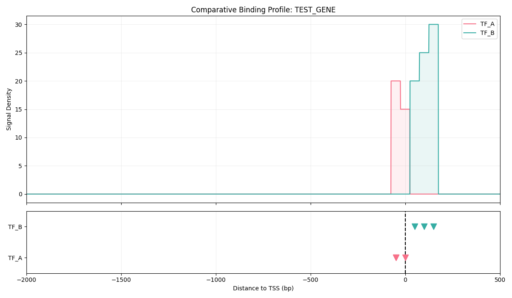
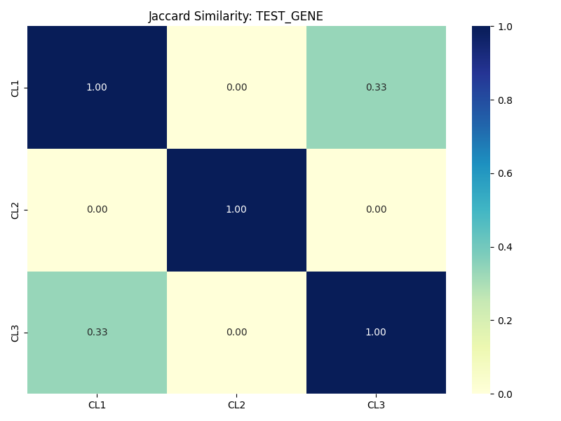

# 🧬 TF-Explorer – ChIP-seq Promoter Scanner

<p align="center">
  <a href="https://github.com/Rashidmstar12/TF-Explorer-ChIP-seq-Promoter-Scanner/blob/main/LICENSE">
    
  </a>
  <a href="https://www.python.org/downloads/">
    
  </a>
  
  <a href="https://github.com/Rashidmstar12/TF-Explorer-ChIP-seq-Promoter-Scanner/actions">
    
  </a>
</p>

<p align="center">
  <b>Query real ENCODE ChIP-seq data · Scan JASPAR motifs · Interactive Streamlit GUI</b><br>
  Analyze transcription factor (TF) binding at the promoter of <i>any human gene</i> in minutes.
</p>

---

**TF-Explorer** is an open-source Python tool that bridges two gold-standard genomics databases — [ENCODE](https://www.encodeproject.org/) and [JASPAR](https://jaspar.elixir.no/) — to give researchers instant answers about which transcription factors bind near a gene of interest.

Whether you are investigating a novel gene like *PWWP2A* or a well-known oncogene like *TP53* or *MYC*, TF-Explorer automates the entire workflow: fetching ChIP-seq peak files, intersecting them with the promoter window, scanning the sequence for PWM motifs, designing validation primers, and producing publication-ready figures — all from a single command or a click in the web app.

## 📸 Screenshots

| Promoter Track | Cell-Line Heatmap |
|---|---|
|  |  |

## ✨ Features

| Feature | Description |
|---|---|
| 🔬 **ENCODE Integration** | Automatically queries and downloads TF ChIP-seq peak files for your gene |
| 🧬 **Gene-Agnostic** | Works for *any* human gene — just supply the gene symbol |
| 🖥️ **Interactive GUI** | User-friendly Streamlit web app, no coding required |
| 📍 **Transcript Selection** | Choose the correct TSS from all annotated transcripts |
| 🎯 **Primer Design** | Design ChIP-qPCR primers with a visual peak-distribution plot |
| 📊 **Multi-Cell-Line Comparison** | Jaccard similarity heatmap and stacked track plots across cell lines |
| 🔁 **Multi-TF Comparison** | Compare binding patterns of different TFs on the same promoter |
| 🏔️ **Strict & Loose Windows** | Analyze binding in a tight promoter region and a wider ±5 kb window |
| 🔍 **Motif Scanning** | Predict binding sites using JASPAR PWMs (Biopython PSSM engine) |
| 🧩 **CpG Island Detection** | Identify CpG islands in the promoter with GC-content sliding-window profile |
| 🤝 **TF Co-binding Heatmap** | Count biosamples where each TF pair co-binds to reveal regulatory cooperation |
| 🔗 **UCSC Browser Link** | One-click link to view the promoter region in the UCSC Genome Browser |
| 📈 **Visualizations** | Binding density plots, peak overlay tracks, and signal-wave plots |
| 💾 **Reproducible Output** | CSV tables, BED files, YAML config, and PNG figures saved per run |

## 🚀 Quick Start

### 1 · Install

```bash
# Clone the repository
git clone https://github.com/Rashidmstar12/TF-Explorer-ChIP-seq-Promoter-Scanner.git
cd TF-Explorer-ChIP-seq-Promoter-Scanner

# Install dependencies and the package
pip install -r requirements.txt
pip install .
```

### 2 · Run the GUI (recommended for beginners)

```bash
python -m streamlit run tf_explorer/app.py
```

The app opens automatically in your browser. Enter a gene symbol, select TFs and cell lines, and click **Analyse**.

### 3 · Run the CLI

```bash
tf-explorer \
  --gene TP53 \
  --tf-list "E2F1,YY1,MYC,CREB1" \
  --jaspar-ids "MA0024.1,MA0095.1" \
  --promoter-up 2000 \
  --promoter-down 500 \
  --bed-output \
  --plot-track \
  --out results/
```

Or try the bundled demo (Windows):

```cmd
run_demo.bat
```

## 💡 Use Cases

- **Hypothesis generation** – Discover which TFs are likely to regulate your gene of interest before designing experiments.
- **ChIP-seq primer design** – Use the primer design tab to get validated primer pairs targeting real peaks in your promoter.
- **Cross-cell-line analysis** – Identify cell-type-specific TF binding by comparing multiple ENCODE biosamples.
- **Teaching** – An accessible, visual gateway to public ChIP-seq data for students and trainees.
- **Manuscript preparation** – Generate publication-quality figures directly from the GUI.

## 📖 CLI Reference

| Argument | Default | Description |
|---|---|---|
| `--gene` | *(required)* | Target gene symbol, e.g. `TP53` |
| `--batch-genes` | — | Path to a file with one gene symbol per line |
| `--tf-list` | — | Comma-separated ENCODE TF names, e.g. `E2F1,MYC` |
| `--jaspar-ids` | auto | Comma-separated JASPAR Matrix IDs or TF names |
| `--genome` | `hg38` | Genome assembly |
| `--promoter-up` | `2000` | bp upstream of TSS |
| `--promoter-down` | `500` | bp downstream of TSS |
| `--threshold` | `8.0` | PWM score threshold |
| `--bed-output` | off | Write a BED file of overlapping peaks |
| `--plot-track` | off | Generate a promoter track PNG |
| `--out` | `results` | Output directory |

## 📂 Output Files

| File | Description |
|---|---|
| `[GENE]_encode_hits.csv` | ENCODE peaks overlapping the promoter |
| `[GENE]_motif_predictions.csv` | Predicted binding sites from JASPAR PWMs |
| `[GENE]_experiment_stats.csv` | Per-file statistics (strict & loose peaks) |
| `[GENE]_combined_summary.csv` | High-level summary of all findings |
| `[GENE]_cpg_islands.csv` | CpG islands detected in the promoter sequence |
| `[GENE]_promoter_seq.txt` | Promoter DNA sequence used in the analysis |
| `[GENE]_tf_binding_plot.png` | Promoter track visualization |
| `config_used.yaml` | Exact parameters used for reproducibility |

## 🤝 Contributing

Contributions are very welcome! Please read [CONTRIBUTING.md](CONTRIBUTING.md) for guidelines on how to open issues and submit pull requests.

## 📄 License

This project is licensed under the **MIT License** — see [LICENSE](LICENSE) for details.

## 📚 Citation

If you use TF-Explorer in your research, please cite the associated preprint/paper (see `TF_Explorer_Paper_v1.1.docx` in the repository) and acknowledge the ENCODE and JASPAR databases:

- **ENCODE Project Consortium** (2012) *Nature* 489, 57–74. https://doi.org/10.1038/nature11247
- **JASPAR 2024** Castro-Mondragon *et al.* *Nucleic Acids Research* 2024. https://doi.org/10.1093/nar/gkad1059

## 🙏 Acknowledgements

Built with [Streamlit](https://streamlit.io/), [Biopython](https://biopython.org/), and data from [ENCODE](https://www.encodeproject.org/) & [JASPAR](https://jaspar.elixir.no/).
